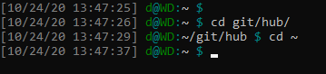

# dotfiles and misc

## moveraf.bat

move raw image files `.RAF` from fuji camera dump into `[currentdirectory]\RAF\` and create directory if it doesn't exist

```powershell
Invoke-WebRequest -UseBasicParsing -Method Get `
 -uri https://raw.githubusercontent.com/dcmaradiaga/dotfiles/master/moveraf.bat `
 -outfile moveraf.bat
```

then **double-click** moveraf.bat or run below

```powershell
.\moveraf.bat
```

## **broken** no-gif-fb

[](https://raw.githubusercontent.com/dcmaradiaga/dotfiles/master/no-gif-fb.user.css)

## **broken** annie-chat

[](https://raw.githubusercontent.com/dcmaradiaga/dotfiles/master/anniechat.user.css)

## **broken** dark-night-fixes

[](https://raw.githubusercontent.com/dcmaradiaga/dotfiles/master/dark-night-fixes.user.css)

assumes that [DarkNight-FBMessenger](https://github.com/cicerakes/DarkNight-FBMessenger) is installed.

## .bashrc


paste just below `color_prompt=` section

```bash
if [ "$color_prompt" = yes ]; then
    PS1='${debian_chroot:+($debian_chroot)}\[\033[90m\][\D{%D} \t] \[\033[32m\]\u\[\033[36m\]@\[\033[32m\]\h\[\033[36m\]:\[\033[00m\]\w\[\033[36m\] \$\[\033[00m\] '
else
    PS1='${debian_chroot:+($debian_chroot)}[\D{%D} \t] \u@\h:\w\$ '
fi
```

## .vimrc

```bash
cd ~
wget https://raw.githubusercontent.com/dcmaradiaga/dotfiles/master/.vimrc
```
